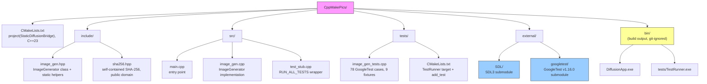
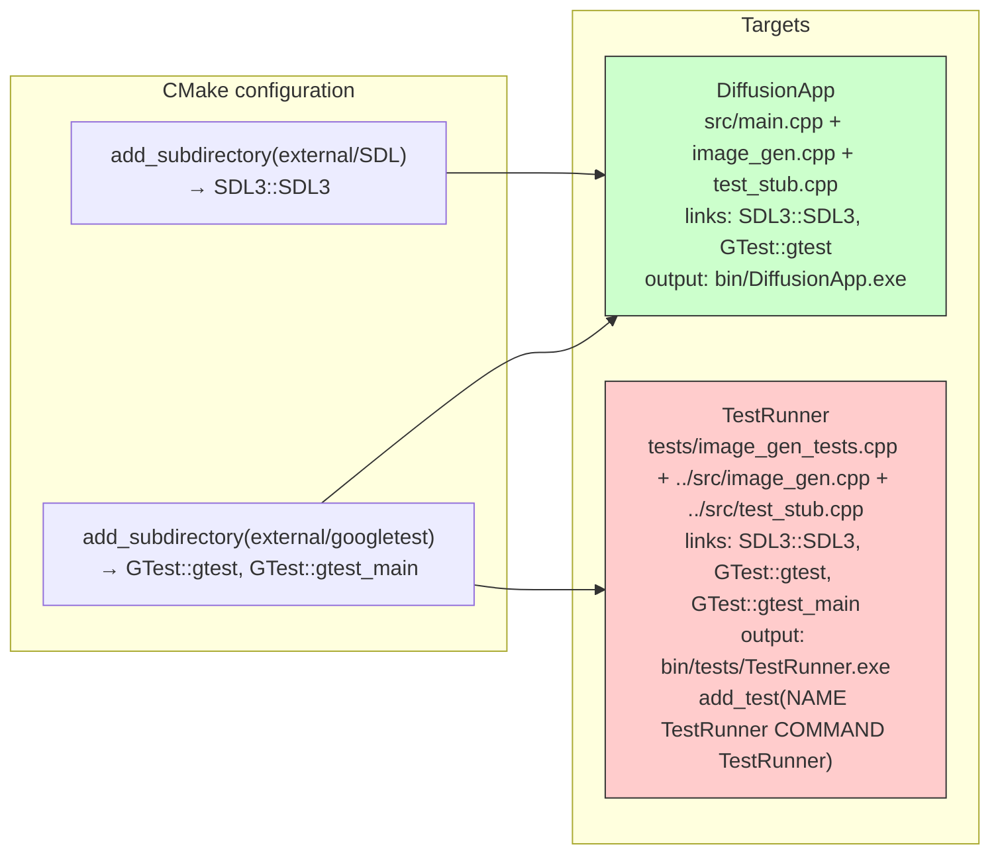
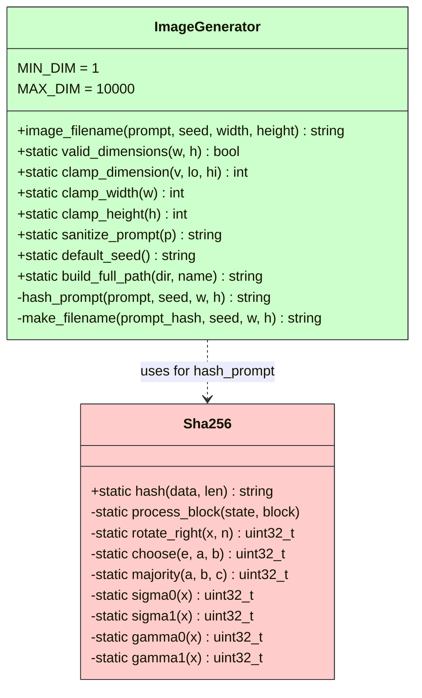

# CppMakePics

Minimal C++23 project providing deterministic image filename generation with
SHA-256 fingerprinting, dimension validation, prompt sanitization, and path
construction. Built with CMake + Ninja, Clang 18, SDL3, and GoogleTest.

## Project structure



## Build targets



## Class API



## Filename format

```
img_<32 hex chars from SHA-256>.png
```

SHA-256 input: `prompt + "\n" + seed + "\n" + width + "x" + height`

Example: `img_a1b2c3d4e5f678901234567890123456.png`

## Test fixtures (78 tests, 9 suites)

| Fixture | Tests | Coverage |
|---|---|---|
| `FilenameTest` | 15 | determinism, uniqueness, format (img\_ prefix, .png suffix, 32 hex chars), edge cases (empty, zero, max, long, unicode) |
| `ImageGeneratorValidDim` | 9 | valid_dimensions: min/max range, zero, negative, over-max, boundaries |
| `ImageGeneratorClamp` | 10 | clamp_dimension, clamp_width, clamp_height, MIN/MAX_DIM constants |
| `SanitizePrompt` | 22 | trim, collapse whitespace, special chars, unicode, long prompts, edge cases |
| `DefaultSeed` | 3 | returns "0", not empty, consistent |
| `BuildFullPath` | 9 | empty dir, trailing slash/backslash, nested, spaces, root-like |
| `Interaction` | 3 | sanitize→filename, valid_dims→filename, clamp→filename |
| `ShaFilenameProperty` | 6 | deterministic, different inputs→different hashes, lowercase hex, length consistency, size encoding, width/height both matter |
| `Fuzz` | 1 | 9 varied inputs (empty, whitespace, long, boundary dimensions) |

## Prerequisites

- **Windows 10/11**
- **LLVM/Clang** — `C:/Program Files/LLVM/bin/clang++.exe` (Clang 18+)
  Or install via Scoop: `scoop install llvm`
- **CMake** 3.25+ with **Ninja** generator
- **Git** with submodules initialized

## Build

```bash
# From repo root
cmake -B build -G Ninja -DCMAKE_BUILD_TYPE=Release \
    -DCMAKE_C_COMPILER=clang \
    -DCMAKE_CXX_COMPILER=clang++
cmake --build build -j$(nproc)
```

Output:
- `bin/DiffusionApp.exe` — main app
- `bin/tests/TestRunner.exe` — test runner

## Run tests

```bash
# Via ctest
cd build
ctest --output-on-failure

# Direct
./bin/tests/TestRunner.exe
```

## Submodules

```bash
git submodule update --init --recursive
```

Current submodules: `external/SDL` (SDL3), `external/googletest` (GoogleTest v1.16.0).

## Compiler

Uses Clang 18.1.8 from `C:/Program Files/LLVM/bin/`. Defined
`_ALLOW_COMPILER_AND_STL_VERSION_MISMATCH` to allow Clang to use MSVC STL.

## License

See external dependencies for their respective licenses. `sha256.hpp` is public domain.
